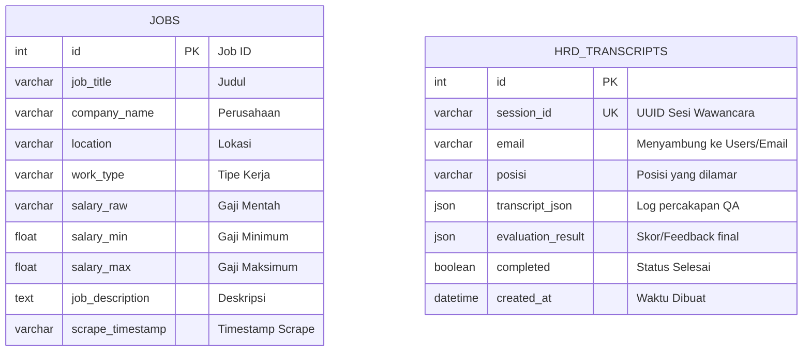
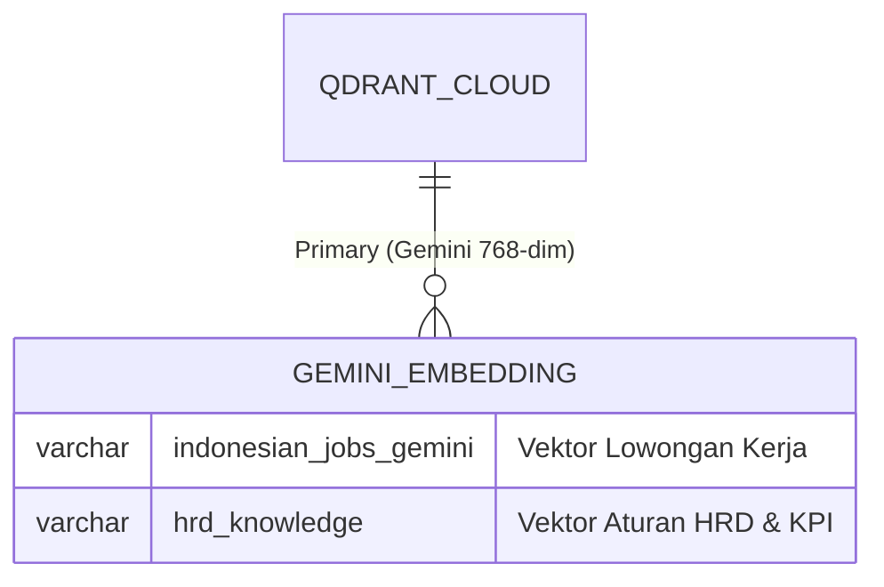

## 1. Entity-Relationship Diagram (ERD) - Relational DB (Aiven MySQL)

Berikut diagram ERD utama yang menggambarkan tabel-tabel inti dalam database MySQL Aiven secara aktual berdasarkan implementasi di `database.py`.

*(Catatan: Tabel USERS, APPLICATIONS, CVS, dan CV_ANALYSIS_RESULTS sebelumnya merupakan rancangan awal (planned), namun secara aktual pada rilis ini hanya 2 tabel di atas yang diaktifkan sebagai tabel inti)*

---

## 2. Vector Collections Schema (Qdrant Cloud)

Berikut adalah struktur koleksi vektor aktual di Qdrant yang menggunakan *embedding* Gemini (`models/gemini-embedding-001`, dimensi 768) sesuai dengan arsitektur Python-Native terkini:

