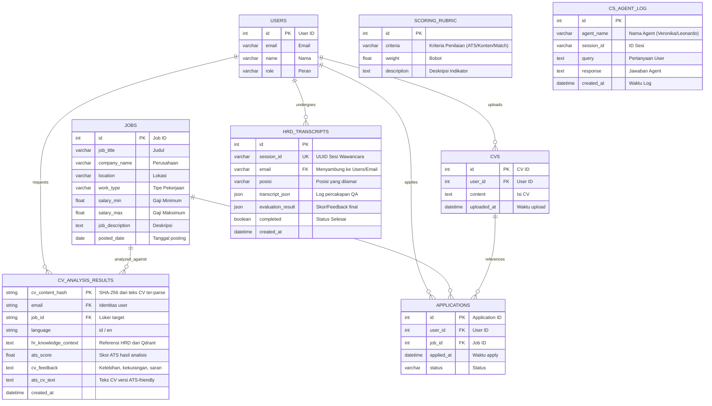
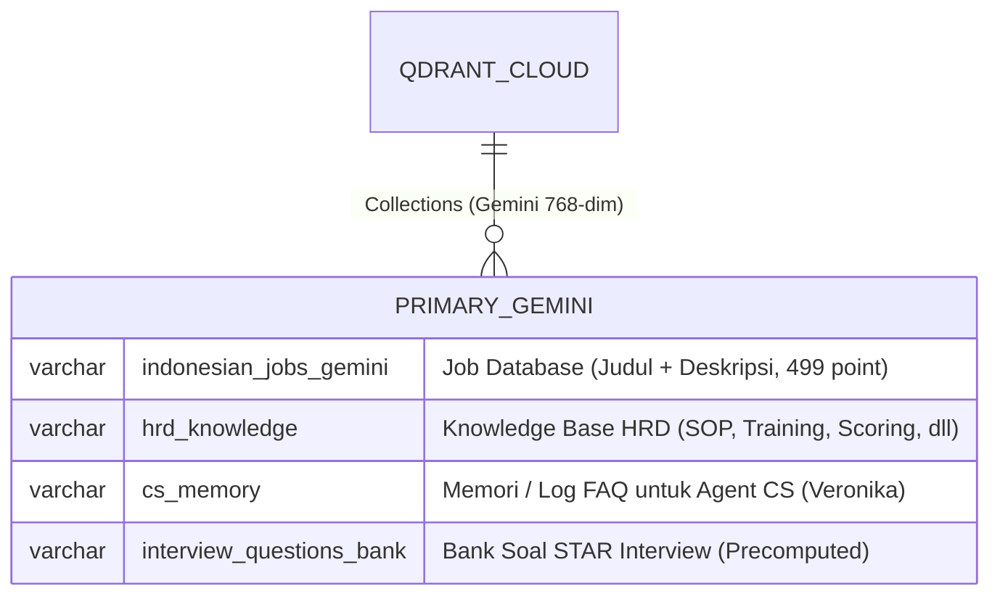

## 1. Entity‑Relationship Diagram (ERD) - Relational DB (Aiven MySQL)

Berikut diagram ERD utama yang menggambarkan tabel‑tabel inti dalam database MySQL Aiven, diperbarui sesuai dengan PRD V4 (100% Python-Native).

---

## 2. Vector Collections Schema (Qdrant Cloud)

Sesuai dengan pembaruan PRD V4 (100% Python-Native), pendekatan OpenAI Fallback telah **dihapus sepenuhnya**. Berikut adalah struktur koleksi vektor di Qdrant yang menggunakan Gemini Embedding (gemini-embedding-001, 768-dim):

