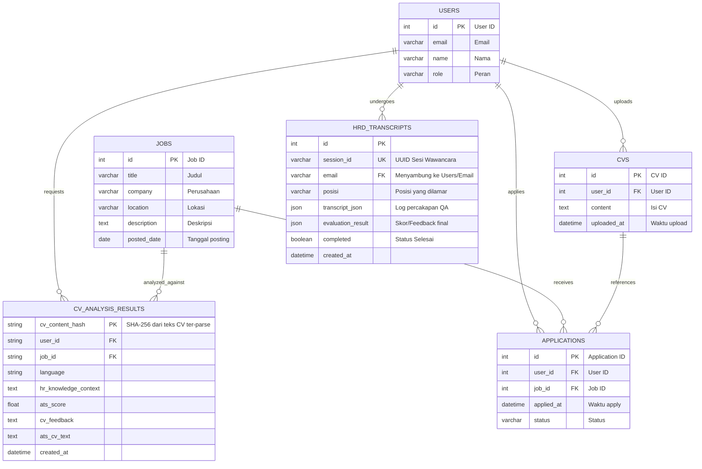

## Entity‑Relationship Diagram (ERD)

Berikut diagram ERD utama yang menggambarkan tabel‑tabel inti dalam database MySQL Aiven.

```mermaid
erDiagram
  USERS ||--o{ CV_ANALYSIS_RESULTS : requests
  JOBS ||--o{ CV_ANALYSIS_RESULTS : analyzed_against
    JOBS {
        int id PK "Job ID"
        varchar title "Judul"
        varchar company "Perusahaan"
        varchar location "Lokasi"
        text description "Deskripsi"
        date posted_date "Tanggal posting"
    }
    USERS {
        int id PK "User ID"
        varchar email "Email"
        varchar name "Nama"
        varchar role "Peran"
    }
    APPLICATIONS {
        int id PK "Application ID"
        int user_id FK "User ID"
        int job_id FK "Job ID"
        datetime applied_at "Waktu apply"
        varchar status "Status"
    }
    CVS {
        int id PK "CV ID"
        int user_id FK "User ID"
        text content "Isi CV"
        datetime uploaded_at "Waktu upload"
    }

    USERS ||--o{ APPLICATIONS : "applies"
    JOBS ||--o{ APPLICATIONS : "receives"
    USERS ||--o{ CVS : "uploads"
    CVS ||--o{ APPLICATIONS : "references"
    USERS ||--o{ HRD_TRANSCRIPTS : "undergoes"

    HRD_TRANSCRIPTS {
        int id PK
        varchar session_id UK "UUID Sesi Wawancara"
        varchar email FK "Menyambung ke Users/Email"
        varchar posisi "Posisi yang dilamar"
        json transcript_json "Log percakapan QA"
        json evaluation_result "Skor/Feedback final"
        boolean completed "Status Selesai"
        datetime created_at
    }

  CV_ANALYSIS_RESULTS {
    string cv_content_hash PK "SHA-256 dari teks CV ter-parse"
    string user_id FK
    string job_id FK
    string language
    text hr_knowledge_context
    float ats_score
    text cv_feedback
    text ats_cv_text
    datetime created_at
  }
```
