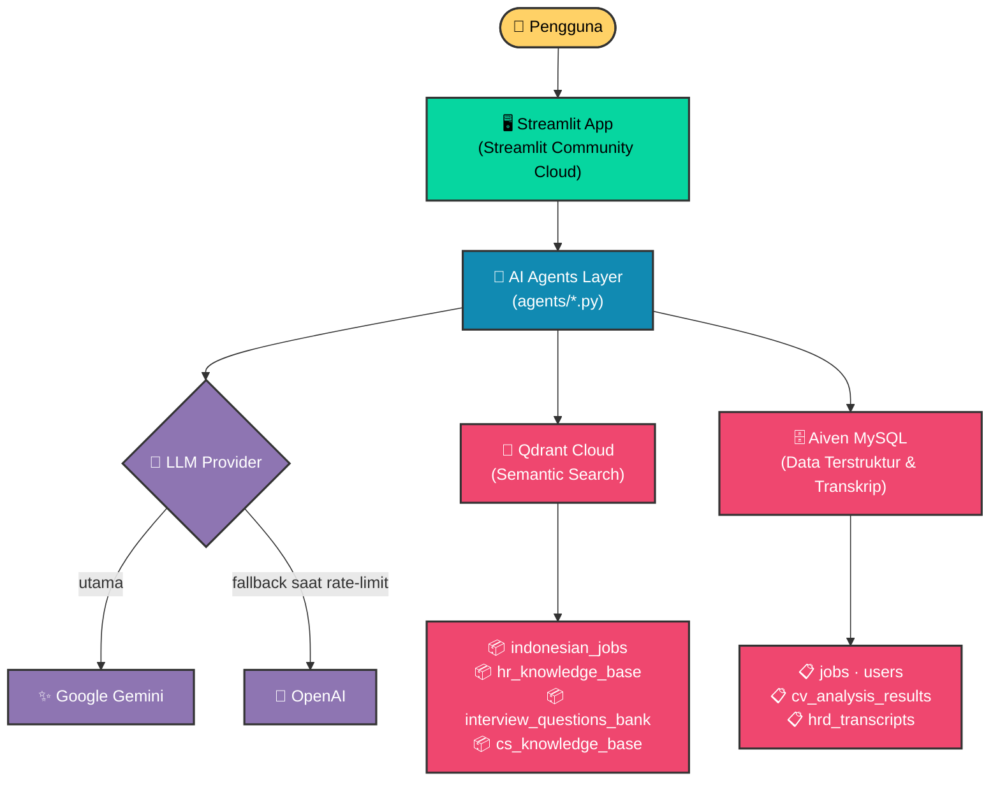
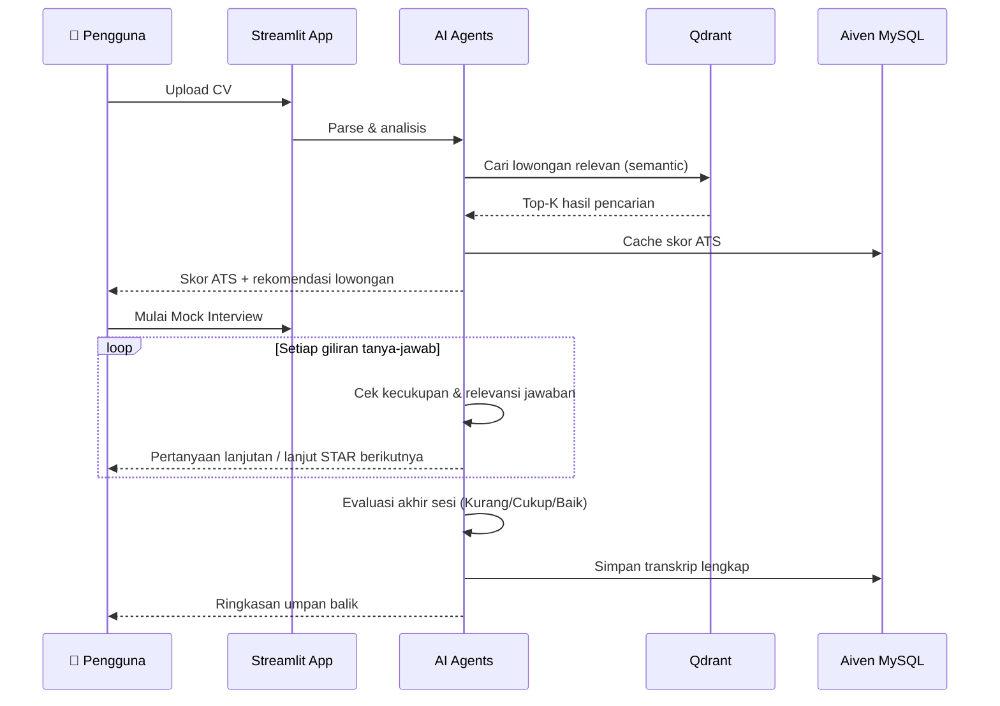

<div align="center">

# 🎯 JobMatch AI

### Platform AI untuk Pencarian Kerja, Analisis CV, dan Simulasi Wawancara — Dibangun untuk Pasar Kerja Indonesia

[](https://www.python.org/)
[](https://jobsmatch.streamlit.app/)
[](https://ai.google.dev/)
[](https://qdrant.tech/)
[](https://aiven.io/)
[](#-arsitektur-sistem)

**[🚀 Coba Live Demo](https://jobsmatch.streamlit.app/)** &nbsp;·&nbsp; **[📖 PRD Lengkap](./PRD_JobMatch_AI.md)** &nbsp;·&nbsp; **[🗂️ ERD Database](./ERD_JobMatch_AI.md)**

</div>

---

## 🧩 Kenapa Project Ini Dibuat

Pencari kerja di Indonesia menghadapi hambatan yang berulang — dan sistem HR tradisional jarang membantu menyelesaikannya:

| ❌ Masalah | ✅ Solusi JobMatch AI |
|---|---|
| CV gagal lolos parsing ATS karena format/keyword tidak sesuai | Skor ATS otomatis per kategori + saran perbaikan konkret |
| Pencarian lowongan manual di banyak portal, memakan waktu | Pencarian semantik — cukup deskripsikan yang dicari dalam bahasa natural |
| Tidak ada sarana latihan wawancara yang murah & tanpa konsekuensi nyata | Simulasi wawancara HRD berbasis STAR method dengan AI interviewer |
| Pertanyaan berulang ke tim support tanpa jawaban konsisten | Chatbot CS yang grounded pada knowledge base resmi |
| Feedback wawancara yang generik / tidak actionable | Evaluator AI dengan label kualitatif (Kurang/Cukup/Baik) per kompetensi |

---

## ✨ Fitur Utama

| Fitur | Deskripsi | Status |
|---|---|---|
| 📄 **CV Upload & ATS Scoring** | Analisis CV otomatis, skor tertimbang (Parsing 35% · Konten 60% · Match 5%) | ✅ Aktif |
| 🔍 **Semantic Job Search** | Pencarian lowongan berbasis makna (Qdrant + embedding lokal), bukan keyword-matching kaku | ✅ Aktif |
| 💬 **AI Career Consultant** | Konsultasi karier interaktif berbasis konteks CV pengguna | ✅ Aktif |
| 🤖 **CS Chatbot** | Menjawab pertanyaan seputar platform, grounded pada knowledge base | ✅ Aktif |
| 🎙️ **HRD Mock Interview** | Simulasi wawancara STAR multi-turn, dengan evaluasi akhir sesi | ✅ **Baru** |
| 💾 **Transkrip Wawancara** | Riwayat sesi tersimpan otomatis ke Aiven MySQL untuk direview ulang | ✅ **Baru** |

> 🆕 **Modul HRD Mock Interview** adalah pengembangan terbaru — mencakup state tracking multi-turn, guardrail anti-halusinasi, evaluator dengan skala kualitatif, dan penyimpanan transkrip end-to-end. Lihat [PRD_JobMatch_AI.md](./PRD_JobMatch_AI.md) untuk detail teknis lengkap.

---

## 🏗️ Arsitektur Sistem



### 🐍 Kenapa Python-Native, Bukan N8N?

Rubrik penilaian awalnya membuka opsi N8N sebagai orchestrator. Setelah pengembangan modul HRD Mock Interview yang membutuhkan **state management kompleks** (multi-turn conversation, guardrail follow-up, fallback LLM saat rate-limit), keputusan arsitektur beralih ke Python-native murni:

- 🧪 **Testability** — 8 test suite otomatis (`pytest`) untuk validasi logic, sulit dicapai dengan node visual N8N
- 🔗 **Integrasi langsung** — SQLAlchemy ↔ Aiven MySQL tanpa lapisan webhook tambahan
- 🛡️ **Guardrail presisi** — validasi output LLM (anti-halusinasi, anti-echo) yang butuh kontrol level-kode

> File workflow N8N lama tetap diarsipkan di [`archive/n8n_legacy/`](./archive/n8n_legacy/) — bukan dihapus, sebagai referensi historis.

---

## 🛠️ Tech Stack

| Layer | Teknologi |
|---|---|
| **Frontend** |  + Google OAuth |
| **LLM** |  (utama) + OpenAI (fallback rate-limit) |
| **Vector DB** |  Cloud — semantic search |
| **Relational DB** |  via SQLAlchemy |
| **Hosting** | Streamlit Community Cloud |

---

## 🔄 Cara Kerja (End-to-End Workflow)



---

## 🐛 Known Issues & Keterbatasan

<details>
<summary><strong>Klik untuk lihat daftar isu yang diketahui (transparan, sesuai catatan PRD)</strong></summary>

<br>

- **Insiden kehilangan data (23 Juli 2026):** Dua collection Qdrant lama (`job_embeddings`, `indonesian_jobs_gemini`) terhapus permanen saat proses cleanup — keduanya sudah tidak dipakai kode aktif, dampak fungsional nol, tapi dicatat sebagai insiden proses. Detail lengkap di [PRD_JobMatch_AI.md](./PRD_JobMatch_AI.md#catatan-jujur-insiden-kehilangan-data-data-loss).
- **Rate limit Gemini:** Pada beban tinggi, sistem otomatis fallback ke OpenAI — pastikan `OPENAI_API_KEY` terisi di environment.
- **ANN approximate search:** Qdrant menggunakan HNSW (approximate nearest neighbor) — hasil pencarian bisa sedikit melewatkan dokumen paling relevan pada parameter `ef_search` rendah.
- **Skala pilot:** Sistem dirancang untuk penggunaan kecil-menengah, bukan trafik produksi skala besar.

</details>

---

## 🚀 Getting Started (Lokal)

```bash
git clone https://github.com/indri007/sweet-align-hub.git
cd sweet-align-hub

python3 -m venv venv
source venv/bin/activate      # Windows: venv\Scripts\activate

pip install -r requirements.txt --break-system-packages

cp .env.example .env          # isi kredensial Anda sendiri
streamlit run app.py
```

> 📄 Lihat [PRD_JobMatch_AI.md](./PRD_JobMatch_AI.md) untuk daftar lengkap environment variable yang dibutuhkan.

---

## 📚 Dokumentasi Lengkap

| Dokumen | Isi |
|---|---|
| [`PRD_JobMatch_AI.md`](./PRD_JobMatch_AI.md) | Requirement produk, keputusan arsitektur, catatan insiden |
| [`ERD_JobMatch_AI.md`](./ERD_JobMatch_AI.md) | Skema database (Mermaid ERD) |
| [`PRD_JobMatch_AI_Redeploy.md`](./PRD_JobMatch_AI_Redeploy.md) | Panduan teknis redeploy |

---

<div align="center">

### 👥 Dikembangkan sebagai Final Project — JCAI (Job Connector AI Engineering), Purwadhika

*Dibangun dengan 🐍 Python, ☕ waktu begadang, dan proses debugging yang cukup panjang.*

</div>
