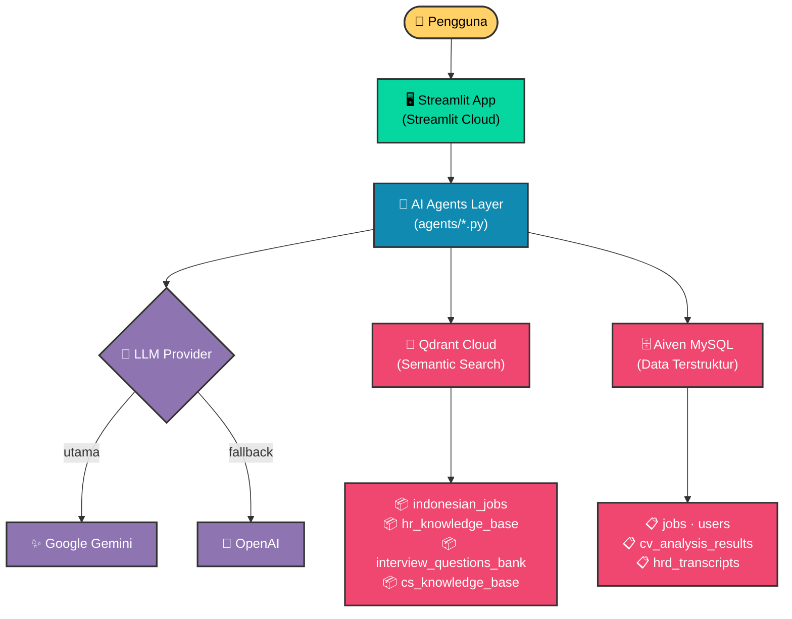

# 🎯 JobMatch AI
### Platform AI untuk Pencarian Kerja, Analisis CV, dan Simulasi Wawancara
*Dibangun khusus untuk Pasar Kerja Indonesia* 🇮🇩

 

  

**[📖 Baca PRD Lengkap](./PRD_JobMatch_AI.md)** &nbsp;&bull;&nbsp; **[🗂️ Lihat ERD Database](./ERD_JobMatch_AI.md)**

---

## 🧩 Kenapa Project Ini Dibuat?

Pasar kerja di Indonesia saat ini sangat kompetitif. Banyak talenta berbakat yang gagal ke tahap wawancara hanya karena resume mereka **tidak teroptimasi untuk sistem pelacakan pelamar (ATS)**, atau mereka kesulitan mencari lowongan yang benar-benar relevan dengan keahlian spesifik mereka.

**JobMatch AI** hadir untuk menjembatani kesenjangan tersebut. Kami memanfaatkan teknologi Generative AI terbaru untuk memberikan evaluasi objektif dan bimbingan yang terpersonalisasi. Mulai dari analisis kelayakan CV secara otomatis hingga simulasi wawancara mendalam, platform ini dirancang untuk bertindak sebagai **Konsultan Karier Pribadi 24/7** bagi setiap pencari kerja.

| ❌ Masalah yang Sering Terjadi | ✅ Solusi JobMatch AI |
|:---|:---|
| CV ditolak bot ATS karena format/keyword salah | **Skor ATS otomatis** + saran perbaikan konkret |
| Pencarian lowongan manual memakan waktu | **Pencarian Semantik** — deskripsikan dengan natural |
| Tidak ada sarana latihan wawancara profesional | **Simulasi HRD AI** berbasis *STAR method* |
| Pertanyaan berulang ke CS memakan waktu | **Chatbot Support 24/7** dengan *Knowledge Base* resmi |
| Feedback dari wawancara biasanya sangat generik | **Evaluasi AI Detail** per kategori kompetensi |

---

## ✨ Fitur Utama yang Mengubah Permainan

### 📄 1. CV Upload & ATS Scoring
Sistem langsung membaca PDF Anda, mengekstrak pengalaman, dan memberikan skor kelayakan berdasarkan standar HRD modern.
*(Penilaian didasarkan pada: Parsing 35% · Konten 60% · Match 5%)*

### 🔍 2. Semantic Job Search
Jangan lagi pusing memikirkan *keyword* kaku. Ketik saja, *"Saya lulusan desain grafis yang suka bikin logo dan ngerti marketing dikit"*, dan AI akan mencari kecocokan makna menggunakan **Qdrant Vector Database**.

### 🤖 3. Konsultan Karier & Chatbot CS AI
Bingung harus mulai dari mana? Tanyakan langsung ke AI. Chatbot dilatih khusus untuk memahami konteks resume Anda dan menjawab pertanyaan umum platform.

### 🎙️ 4. HRD Mock Interview (Fitur Baru!)
Simulasi wawancara *multi-turn* (tanya-jawab interaktif) menggunakan pendekatan metode STAR. AI akan menempatkan dirinya sebagai HRD yang sesungguhnya dan mengevaluasi jawaban Anda di akhir sesi, lengkap dengan transkrip yang disimpan di database Aiven MySQL.

---

## 🏗️ Arsitektur Sistem Berkelas Enterprise

Keseluruhan sistem ini dibangun menggunakan **Python-native murni**, membuang dependensi alat pihak ketiga seperti n8n untuk mendapatkan kecepatan maksimal, *state management* yang kuat, dan kontrol penuh atas *guardrail* (anti-halusinasi AI).

---

## 🎨 Material 3 Premium UI

Antarmuka **JobMatch AI** tidak hanya cerdas, tetapi juga **menawan secara visual**. Kami mendesain khusus *(custom CSS)* seluruh aplikasi menggunakan pedoman desain **Material 3 Dark Theme**:
- 🌌 **Glassmorphism:** Navigasi tembus pandang bergaya modern.
- 💊 **Pill-shaped Elements:** Sudut melengkung halus untuk pengalaman yang ramah pengguna.
- ✨ **Micro-animations:** Tombol *Pulse-glow* dan efek *hover* interaktif yang membuat aplikasi terasa sangat "hidup".

---

  <b>Siap mendapatkan pekerjaan impian Anda berikutnya?</b>  
  

